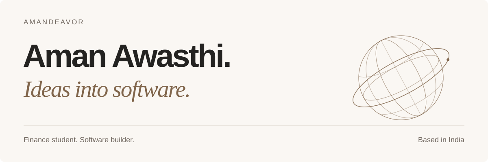

  

  <a href="https://amandeavor.netlify.app/">Portfolio</a>&nbsp;&nbsp;·&nbsp;&nbsp;
  <a href="https://linkedin.com/in/amandeavor">LinkedIn</a>&nbsp;&nbsp;·&nbsp;&nbsp;
  <a href="mailto:amandeavor@gmail.com">Email</a>&nbsp;&nbsp;·&nbsp;&nbsp;
  <a href="https://github.com/amandeavor/Aman-CLI">Aman CLI</a>&nbsp;&nbsp;·&nbsp;&nbsp;
  <a href="https://github.com/amandeavor/ObsidianKit">ObsidianKit</a>&nbsp;&nbsp;·&nbsp;&nbsp;
  <a href="https://github.com/amandeavor/Aetheris-OS">Aetheris OS</a>

## About

I am pursuing a **B.Com (Hons.) in Banking & Finance** and preparing for **CA Foundation**. In parallel, I build software across developer tooling, browser applications, automation, and Linux systems.

My public work spans **TypeScript, Node.js, React, Python, Rust, C, and Linux tooling**. I am especially interested in practical systems: tools that solve a clear problem, behave predictably, and are documented well enough for someone else to understand and maintain.

## Selected work

| Project | What I built | Stack |
| :--- | :--- | :--- |
| [**Aetheris OS**](https://github.com/amandeavor/Aetheris-OS) | Experimental Void Linux system project with hardware and driver tooling, a Tauri installer and software center, first-boot setup, package templates, system configuration, and a preload daemon. | Rust, C, Svelte, Tauri, Linux |
| [**Aman CLI**](https://github.com/amandeavor/Aman-CLI) | Command-line tooling for installing and organizing AI workflow assets such as skills, prompts, MCP configurations, packs, and stacks. | TypeScript, Node.js |
| [**ObsidianKit**](https://github.com/amandeavor/ObsidianKit) | Browser-native toolbox for document, image, media, calculator, and utility workflows, with a public web deployment. | React, TypeScript, Vite |
| [**Sweepr**](https://github.com/amandeavor/Sweepr) | Terminal file organizer with dry-run previews, undo manifests, and organization by file type or modification date. | Python, Typer, Rich |

## Open-source maintenance

I contribute focused fixes, regression coverage, issue triage, and pull-request reviews. I currently help maintain [**opencode-mem**](https://github.com/tickernelz/opencode-mem) and [**awesome-free-apps**](https://github.com/Axorax/awesome-free-apps).

- **Merged:** [**jest-codemods #672**](https://github.com/skovhus/jest-codemods/pull/672) fixed a TypeScript edge case where callbacks declaring a special `this` parameter could be transformed into invalid arrow-function syntax, with regression coverage.
- **In review:** [**rtk #3755**](https://github.com/rtk-ai/rtk/pull/3755) adds Windows-aware routing for `py`, virtual-environment, and full-path Python test launchers while preserving `pytest` and `unittest` behavior.
- **In review:** [**tensorflow-onnx #2487**](https://github.com/onnx/tensorflow-onnx/pull/2487) fixes Keras 3 model-output mapping against traced TensorFlow tensors and adds `.keras` save/load regression coverage.
- **In review:** [**svg2pdf.js #372**](https://github.com/yWorks/svg2pdf.js/pull/372) corrects PDF link-annotation hitboxes generated from SVG element bounds and adds browser regression coverage.
- **Merged:** [**opencode-mem #279**](https://github.com/tickernelz/opencode-mem/pull/279) reduces DiskANN vector-index storage overhead, and [**#290**](https://github.com/tickernelz/opencode-mem/pull/290) adds matched-memory feedback to Web UI search.
- **In review:** [**opencode-mem #289**](https://github.com/tickernelz/opencode-mem/pull/289) preserves provider parameters during profile cleanup.

## Engineering approach

- Reproduce the failure before changing the implementation.
- Add regression coverage where the project makes it practical.
- Prefer small, reviewable fixes over broad rewrites.
- Keep documentation aligned with what the repository actually does.
- Use clear defaults, explicit failure modes, and reversible workflows.

## Current focus

Financial analysis and investment-banking fundamentals · CA Foundation preparation · developer tools and automation · Linux and systems software · deeper open-source maintenance

## Technologies

  <picture>
    <source media="(prefers-color-scheme: dark)" srcset="https://skillicons.dev/icons?i=ts%2Cjs%2Cnodejs%2Creact%2Cvite%2Cpy%2Crust%2Cc%2Csvelte%2Ctauri%2Cgit%2Clinux&amp;theme=dark" />
    
  </picture>

