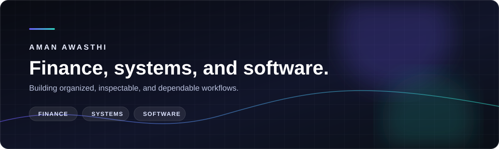
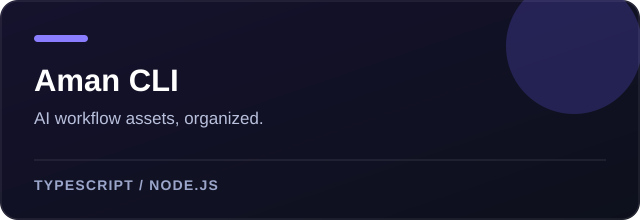
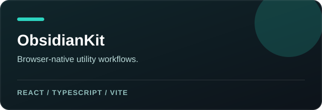
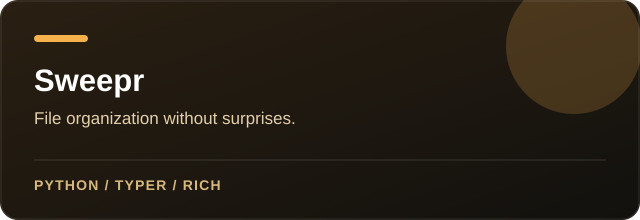
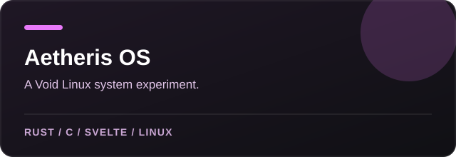

  

  <a href="https://amandeavor.netlify.app"><strong>Portfolio</strong></a>
  &nbsp;&nbsp;·&nbsp;&nbsp;
  <a href="https://github.com/amandeavor/Aman-CLI"><strong>Aman CLI</strong></a>
  &nbsp;&nbsp;·&nbsp;&nbsp;
  <a href="https://github.com/amandeavor/ObsidianKit"><strong>ObsidianKit</strong></a>

I am pursuing a B.Com (Hons.) in Financial Analysis and Business Intelligence in academic partnership with EY, alongside CA Foundation preparation. I combine analytical thinking with hands-on engineering to build tools that make complex work more organized, inspectable, and reliable.

<table>
  <tr>
    <td width="33%" valign="top">
      <strong>01 / Analyze</strong> 
      Financial analysis, business intelligence, and investment-banking fundamentals.
    </td>
    <td width="33%" valign="top">
      <strong>02 / Build</strong> 
      Developer tools, AI workflow infrastructure, automation, and web applications.
    </td>
    <td width="33%" valign="top">
      <strong>03 / Understand</strong> 
      Linux systems, command-line utilities, and well-documented open source.
    </td>
  </tr>
</table>

## Selected work

  
  

  
  

## Technical foundation

My public work spans TypeScript and React applications, Node.js CLI tooling, Python automation, and Linux-oriented components in Rust and C. I value clear documentation, sensible defaults, and software that respects the people who use it.

## Current direction

Building at the intersection of financial analysis, business intelligence, developer tooling, and systems software.
