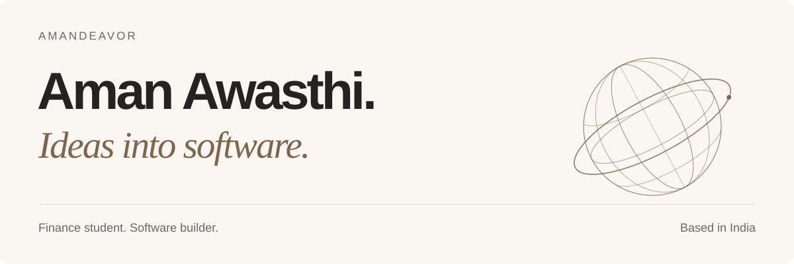

<a href="https://amandeavor.pages.dev/">
  <picture>
    <source media="(prefers-color-scheme: dark)" srcset="./assets/profile-header-dark.svg" />
    
  </picture>
</a>

[**Visit my portfolio ↗**](https://amandeavor.pages.dev/) · [LinkedIn](https://linkedin.com/in/amandeavor) · [Email](mailto:amandeavor@gmail.com)

 

I’m **Aman Awasthi**, a software builder studying Banking & Finance in India.

Alongside my B.Com (Hons.) and CA Foundation preparation, I work on developer tools, browser applications and Linux systems.

I like work where the details matter: a command that previews its changes, an error that explains what happened, a fix someone else can review.

 

## Open-source contributions

I help maintain [**opencode-mem**](https://github.com/tickernelz/opencode-mem) and [**awesome-free-apps**](https://github.com/Axorax/awesome-free-apps), and contribute fixes and tests to developer tools.

**33 merged pull requests across 18 external repositories** (133 merged PRs across all repositories), verified on October 10, 2026. [Browse the contribution record →](./CONTRIBUTIONS.md)

| Project | Selected merged work |
| --- | --- |
| **opencode-mem** | [Reduce storage overhead for new vector indexes](https://github.com/tickernelz/opencode-mem/pull/279), [do not mark failed tag migrations as processed](https://github.com/tickernelz/opencode-mem/pull/319), and [show matched-memory counts](https://github.com/tickernelz/opencode-mem/pull/290). |
| **compio** | [Skip empty UDP datagrams in QUIC endpoint](https://github.com/compio-rs/compio/pull/1070). |
| **Uno Platform** | [Correct Compass ReportInterval support for iOS and WASM](https://github.com/unoplatform/uno/pull/24655). |
| **RTK** | [Count rtk uv rows as Python](https://github.com/rtk-ai/rtk/pull/4328) and [count sudo RTK_DISABLED=1 commands as bypass](https://github.com/rtk-ai/rtk/pull/3808). |
| **Wave** | [Handle non-UTF-8 program output in the native case runner](https://github.com/wavefnd/Wave/pull/743) and [reject null write buffers before opening files](https://github.com/wavefnd/Wave/pull/742). |
| **Inversify** | [Validate OpenAPI base-URI declarations](https://github.com/inversify/monorepo/pull/2104) and [support discriminated errors in HTTP error filters](https://github.com/inversify/monorepo/pull/2108). |
| **test-reporter** | [Surface PHPUnit JUnit error details](https://github.com/dorny/test-reporter/pull/834) and [handle test failures with attribute-only messages](https://github.com/dorny/test-reporter/pull/814). |
| **repodx** | [Detect secrets exposed through public env prefixes](https://github.com/omerbek/repodx/pull/29). |
| **rolecraft** | [Use UserError for skill-not-found in remove and update APIs](https://github.com/rolecraft-sh/rolecraft/pull/298). |
| **vitepress-carbon** | [Import markdown-it as a type only](https://github.com/brenoepics/vitepress-carbon/pull/346) and [drop invalid `:deep()` from unscoped DocSearch styles](https://github.com/brenoepics/vitepress-carbon/pull/345). |
| **svg2pdf.js** | [Align PDF link hitboxes with rendered SVG elements](https://github.com/yWorks/svg2pdf.js/pull/372). |
| **shep** | [Clarify view and deliver documentation comments](https://github.com/shep-pm/shep/pull/621). |
| **freeCodeCamp** | [Correct integers/floats lecture terminology](https://github.com/freeCodeCamp/freeCodeCamp/pull/70378). |
| **jest-codemods** | [Preserve TypeScript `this` parameters during migration](https://github.com/skovhus/jest-codemods/pull/672). |
| **awesome-free-apps** | [Make link audits detect HTTP failures, limit concurrency, and return meaningful exit statuses](https://github.com/Axorax/awesome-free-apps/pull/296). |

Selected contributions under active review

- [reticle #1085](https://github.com/reticlehq/reticle/pull/1085): Document verify --expect-file and PowerShell usage.
- [reticle #1089](https://github.com/reticlehq/reticle/pull/1089): Do not present unattributed listeners as this app.
- [compio-rs #1071](https://github.com/compio-rs/compio/pull/1071): Invert may_fragment polarity and skip empty UDP datagrams in QUIC.
- [LibreUML #131](https://github.com/LibreUML/LibreUML/pull/131): Write edge-anchoring screenshots under os.tmpdir().
- [tensorflow-onnx #2487](https://github.com/onnx/tensorflow-onnx/pull/2487): Keras 3 model-output mapping and save/load regression coverage.

These pull requests are actively under review as of October 10, 2026.

 

## Selected work

### [Aetheris OS ↗](https://github.com/amandeavor/Aetheris-OS)

An experimental Void Linux system with installation, setup and software-management tools.

Rust · C · Svelte · Tauri · Linux

### [Aman CLI ↗](https://github.com/amandeavor/Aman-CLI)

Installs and organizes skills, prompts and MCP configurations for AI workflows.

TypeScript · Node.js

### [ObsidianKit ↗](https://github.com/amandeavor/ObsidianKit)

A browser toolbox for document, image, media and everyday utility tasks.

React · TypeScript · Vite

### [Sweepr ↗](https://github.com/amandeavor/Sweepr)

Organizes files from the terminal, with dry-run previews and undo manifests.

Python · Typer · Rich

 

[View all work on my portfolio →](https://amandeavor.pages.dev/projects/)

 

## How I work

**Understand the failure.** Reproduce it before changing the implementation.

**Make the fix reviewable.** Keep changes focused and add regression coverage where it helps.

**Leave a clear trail.** Document actual behavior, explain failures and make changes reversible.

 

## Notes from building

- [Linux desktop latency: find the cause before tuning](https://amandeavor.pages.dev/blog/optimizing-desktop-latency/)
- [Privacy-first React components: storage and safe defaults](https://amandeavor.pages.dev/blog/privacy-first-components/)
- [Using an AI coding CLI: context, permissions and diff review](https://amandeavor.pages.dev/blog/command-line-ai/)

 

---

**Have something in mind?** [Tell me about it →](https://amandeavor.pages.dev/#contact)
